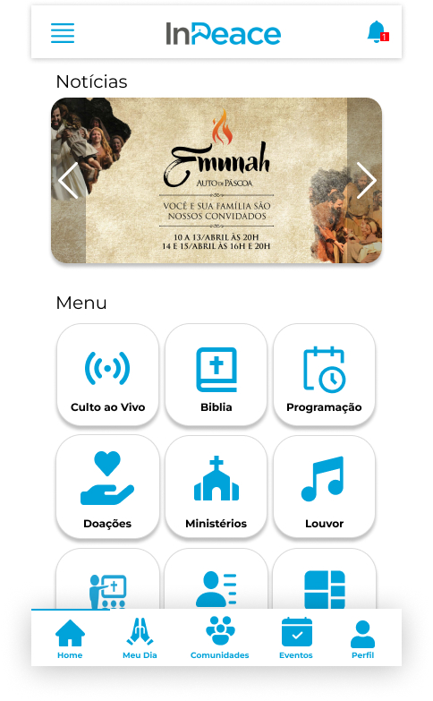
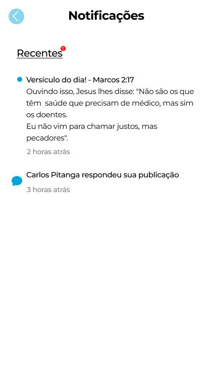

    
    <h1>InovaApps</h1>

Em **2022** e **2023**, participei do Hackathon de inovação, o InovaApps, qual seu principal objetivo era junto a empresas parceiras, desenvolver projetos voltados a aperfeiçoar aplicação e inovações e melhorias para o aplicativo web das empresas parceiras.

O InovaApps foi desenvolvido pela **InPeace** e **UpCities** a fim de incentivar os alunos das áreas de Tecnologia e Design da UVV a usarem a criatividade e colocar suas habilidades em prática. Uma forma de incentivar novos talentos e aproximar as empresas.

O desafio consiste em uma maratona de inovações para criar soluções para resolver dois problemas reais das empresas. Os alunos foram separados em grupos de 3 pessoas e tinham que entregar uma solução de uma nova funcionalidade para o app em apenas 21h.

# 2022: Desafio InPeace
A InPeace é uma startup capixaba que atende igrejas no mundo inteiro. A empresa entrega para cada cliente, uma plataforma de gestão de todas as áreas da igreja, com gestão financeira, doação online, culto ao vivo, gestão de eventos e etc.  Para cada igreja, também é entregue um aplicativo para manter o contato com os membros. Atualmente a InPeace conta com com os membros. Atualmente a InPeace conta com mais de 6.000 clientes em 17 países.

**Desafio:** Como ser ainda mais essencial no dia a dia dos membros e visitantes das igrejas através da tecnologia.

### Entrega feita
Nosso principal objetivo dentro do projeto, foi pensar em uma forma de deixar o aplicativo mais usual no dia dia dos fieís e visitantes, deixando-os mais conectados, dessa forma, adotamos o conceito de comunidades.

O intuito da comunidade, é unir os fiéis para que assim possam juntar interesses em comum e dialogar entre si, criando um vinculo maior entre os integrantes da igreja, trazendo um sentimento de comunidade, tanto para os fiéis, quanto para os visitantes. A comunidade também visa trazer novos membros para dentro da igreja com intuíto de realizarem essa troca de experiências e diálogos em comum.

Por exemplo: Vamos dizer que na minha igreja possui uma comunidade de jovens que são apaixonados por tecnologia, com isso, eles se manterão engajados e também poderão trazer novos jovens para igreja, e assim participarem dessa comunidade.

#### Um pouco das funcionalidades
**Comunidade**:  Aqui, o usuário poderá criar e participar de diferentes comunidades, engaja-las com publições e respostas nas mesmas.
As comunidades são de tema livre, mas para que seja criado uma comunidade, o fiel terá que se reportar a um administrador para ele entender se faz sentido ou não cria-lá.

**Explorar - (Comunidade)**: Aqui será exibido todas comunidades criadas por um administrador, na qual o fiel pode escolher entrar ou não.

**Feed - (Comunidade)**: Aqui será exibido todas as publicações por ordem de última postagem das comunidades em que você participa. 

**Seguindo - (Comunidade)**: Aqui será exibido todas comunidades que o fiel segue.

**Grupos - (Comunidade)**: Mantivemos a mesma função de grupos do aplicativo original, mas para fazer sentido com nosso novo layout, reformulamos algumas telas.

Entrando nas comunidades, nas postagens, você consegue visualizar a tag de referência a uma comunidade no canto superior direito, também consegue visualizar quando o membro é novo, por ordem de cor no nome, do mais claro pro mais escuro, mostra o quanto o membro é mais antigo na comunidade.

**Meu dia**: Aqui o usuário terá sugestão de versículo do dia para meditar sobre com sua família ou amigos, que podem ser aleatórios ou informado pelo líder de sua igreja, também nessa funcionalidade, encontramos a sugestão de oração do dia e sugestão de louvor do dia.

**Sistema de Recompensa**: Pensando na maneira de recompensar o fiel por usar o aplicativo, adotamos o sistema de recompensa por insignia, que será exibido em seu perfil dentro da comunidade, os fieis poderão ver o nome das insignias ao passar o mouse ou clicar sobre elas. As insignias funcionará da seguinte forma, ao fiel cumprir determinadas metas dentro do aplicativo ou participar de alguns eventos em específicos, ele será recompensado com um ícone em seu perfil.

**Notificação**: Trará notificações sobre suas publicações além do versículo do dia, que será enviado diáriamente, sendo esse versículo aleátorio ou um versículo cadastrado pelo pastor para ser enviado em algum dia específico

#### Novo Layout
O layout foi remodelado para se encaixar melhor com nossa proposta de inovação, assim pensando em conceitos de UX, na tela inicial colocamos um banner de notícias, na qual fica mais acessível e visível para o leitor ao entrar no aplicativo, logo após temos o menu, onde usamos os conceitos de usabilidade, e agrupamos os botões em nivel de importancia na tela inicial, e no menu lateral os itens estão agrupados por um dropdown.

# 2023